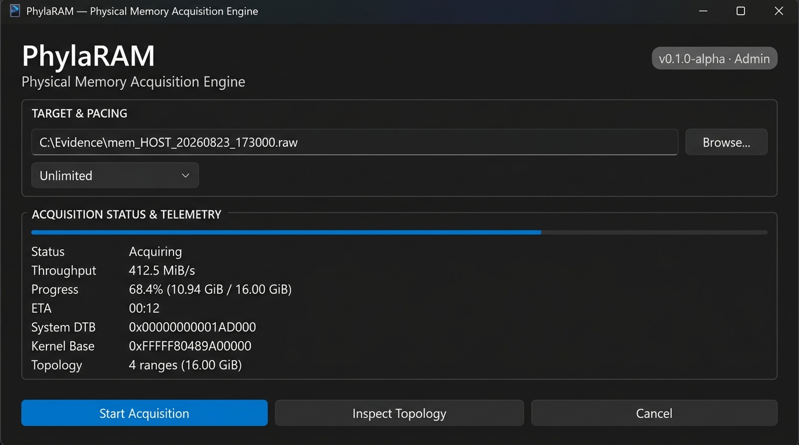
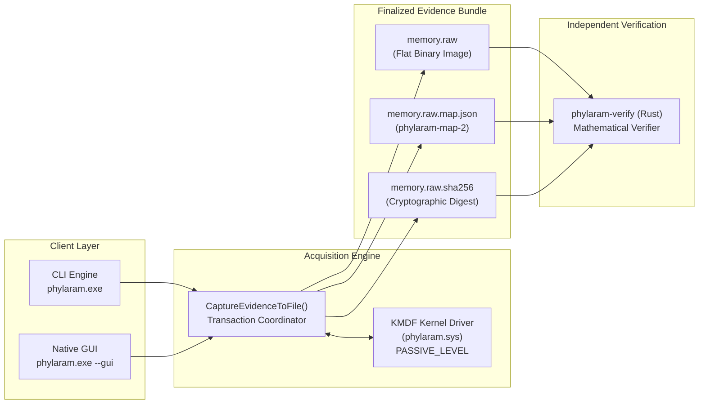

# PhylaRAM

> **Forensically honest live physical-memory acquisition for Windows.**  
> Byte-accurate unreadable-page provenance, physical-address-preserving RAW output, and independent offline mathematical verification.

[](https://github.com/joeyvictorino/phylaram/actions/workflows/ci.yml)
[](https://github.com/joeyvictorino/phylaram/releases)
[](LICENSE)
[](docs/STATUS.md)

---

### Quick Actions

[⬇️ **Download Windows Alpha (Test-Signed)**](https://github.com/joeyvictorino/phylaram/releases) &nbsp;|&nbsp; [📊 **Validation Status & Evidence**](docs/VALIDATION_EVIDENCE.md) &nbsp;|&nbsp; [🧪 **Help Validate**](docs/COMMUNITY_VALIDATION.md) &nbsp;|&nbsp; [💚 **Funding & Sustainability**](FUNDING.md) &nbsp;|&nbsp; [🛠️ **Build From Source**](#building)

---

> [!WARNING]
> **Alpha software. Lab & controlled test environments only.**  
> PhylaRAM's kernel driver (`phylaram.sys`) is currently test-signed with a self-signed certificate for test VMs. Production Microsoft driver signing, Driver Verifier 100-cycle stress, and physical-hardware matrix gates are actively tracked in [`docs/STATUS.md`](docs/STATUS.md).  
> **Do not disable Secure Boot or HVCI/Memory Integrity on a real evidence host merely to load an alpha driver.**

---


*PhylaRAM Native Win32 Desktop Interface (Dark System Canvas, live telemetry inspector, and kernel hints).*

---

## Technical Differentiators

```text
┌──────────────────────────────────────────────────────────────────────────────────────────────────┐
│ 1. Physical-Address-Preserving RAW                                                               │
│    file offset == physical address. Unpopulated hardware gaps are preserved as sparse extents.   │
├──────────────────────────────────────────────────────────────────────────────────────────────────┤
│ 2. UNREADABLE != ZERO Provenance                                                                 │
│    Hardware read errors are isolated to 4 KiB pages and recorded in map.json with exact NTSTATUS.│
│    Unreadable spans are not silently converted to misleading observed zero-filled memory.        │
├──────────────────────────────────────────────────────────────────────────────────────────────────┤
│ 3. Independent Rust Hostile-Input Verifier (phylaram-verify)                                     │
│    Mathematically verifies logical size, range ordering, sum equality, zero-backing, and SHA-256 │
│    without trusting claims made by user-mode code or the kernel driver.                          │
├──────────────────────────────────────────────────────────────────────────────────────────────────┤
│ 4. Bounded Run-Index Kernel Protocol                                                             │
│    User mode cannot submit arbitrary physical addresses. Reads reference a frozen snapshot      │
│    enumerated at session start via MmGetPhysicalMemoryRangesEx2.                                 │
└──────────────────────────────────────────────────────────────────────────────────────────────────┘
```

---

## Architecture

PhylaRAM unifies CLI and GUI clients around a single canonical evidence publication transaction:



---

## 30-Second Quick Start

### 1. Acquire Memory (Elevated Administrator)
```cmd
phylaram.exe C:\evidence\mem_HOST_20260823.raw
```
Or launch the native graphical interface:
```cmd
phylaram.exe --gui
```

Optional rate-limiting is supported in MiB/s:
```cmd
phylaram.exe C:\evidence\mem_HOST_20260823.raw --rate-limit 100
```

### 2. Verify Evidence Bundle
```cmd
phylaram-verify.exe C:\evidence\mem_HOST_20260823.raw C:\evidence\mem_HOST_20260823.raw.map.json C:\evidence\mem_HOST_20260823.raw.sha256
```

### 3. Inspect Live Kernel Hints
```cmd
phylaram.exe --dry-run
```

---

## Finalized Evidence Bundle Contract

Every successful capture transaction produces exactly three files:

```text
memory.raw          # Flat physical-address-preserving binary image
memory.raw.map.json # Canonical provenance map (schema phylaram-map-2)
memory.raw.sha256   # Cryptographic SHA-256 digest of the logical image
```

Publication is atomic: evidence is written to `.partial` staging files. The canonical filenames are promoted only after all bytes have flushed, byte accounting has balanced, and sidecars have finalized.

### Terminal Outcomes & Exit Codes

| Exit Code | Terminal Status | Meaning |
| :---: | :--- | :--- |
| `0` | **Complete** | Full acquisition completed, byte accounting balanced, topology remained stable, and the bundle finalized. |
| `2` | **Incomplete** | Finalized bundle records unreadable hardware spans (`STATUS_DEVICE_DATA_ERROR`) or a topology change during session. |
| `1` | **Failed / Cancelled** | No final evidence bundle published. All temporary staging files cleanly removed. |

---

## Provenance Map Contract (`phylaram-map-2`)

The canonical sidecar (`<output>.map.json`) records strict acquisition facts:
- Producer version, schema version (`phylaram-map-2`), and terminal status (`complete` / `incomplete`);
- Exact byte counts: `logical_size`, `physical_bytes`, `acquired_bytes`, `unreadable_bytes`;
- Re-enumerated topology change detection flag;
- Flat logical SHA-256 digest;
- Frozen physical memory run descriptors (`driver_run`, `start`, `length`);
- Isolated unreadable spans with exact `NTSTATUS` codes;
- Live Ring 0 kernel hints (System process CR3 / DTB, executing CPU KPCR, NTOSKRNL base virtual address and image size, Windows build number).

See [`docs/MAP_SCHEMA.md`](docs/MAP_SCHEMA.md) for the full JSON schema specification.

---

## Offline Mathematical Verifier (`phylaram-verify`)

The independent Rust verifier (`tools/phylaram-verify`) enforces hostile-input validation:

```bash
phylaram-verify memory.raw memory.raw.map.json memory.raw.sha256
```

It proves that:
1. `logical_size == highest physical range end == RAW file size`;
2. Physical ranges are strictly ordered, non-zero, non-overlapping, and sum to `physical_bytes`;
3. `driver_run` indices form a valid contiguous domain;
4. Unreadable spans are wholly contained within reported physical RAM and never overlap;
5. Bytes in the RAW file at offsets recorded as unreadable are zero-backed representation bytes;
6. Terminal status mathematically matches observed unreadable bytes and topology stability;
7. The flat SHA-256 digest over the logical RAW file matches both the map and `.sha256` sidecar.

---

## Building from Source

### Requirements
- Visual Studio 2022 (MSVC v143) with C++20 support
- Windows Driver Kit (WDK) toolchain restored via NuGet
- Rust 1.75+ for `phylaram-verify`

### Windows Build (Driver, CLI, GUI, and Verifier)
```cmd
nuget restore packages.config -PackagesDirectory packages
msbuild PhylaRAM.sln /p:Configuration=Release /p:Platform=x64 /v:minimal /m
```

### Portable Test Suite (macOS / Linux / Windows)
```bash
python3 scripts/engineering_policy_check.py
clang++ -std=c++20 -Wall -Wextra -Werror tests/test_range_algebra.cpp -o /tmp/test_range_algebra && /tmp/test_range_algebra
clang++ -std=c++20 -Wall -Wextra -Werror tests/test_mock_acquire.cpp -o /tmp/test_mock_acquire && /tmp/test_mock_acquire
clang++ -std=c++20 -Wall -Wextra -Werror tests/test_map_json.cpp -o /tmp/test_map_json && /tmp/test_map_json
clang++ -std=c++20 -Wall -Wextra -Werror tests/test_cli_parser.cpp -o /tmp/test_cli_parser && /tmp/test_cli_parser

cd tools/phylaram-verify
cargo test --verbose
```

---

## Validation Status & Open Gates

PhylaRAM maintains complete transparency regarding its verification state. Passing CI builds or offline models does not substitute for hardware validation.

| Gate | Validation Target | Status |
| :--- | :--- | :--- |
| **Gate 1** | Automated MSVC & KMDF CI Build via NuGet Toolset | 🟢 **COMPLETED** |
| **Gate 2** | Static Driver Verifier (SDV) & CodeQL Suite | ⏳ **OPEN / PENDING** (CodeQL ✅, SDV pending) |
| **Gate 3** | Driver Verifier Dynamic Stress Profile (100 Cycles) | ⏳ **OPEN / PENDING** |
| **Gate 4** | Physical Hardware & Topology Matrix (4GB to 128GB+, ReBAR, NUMA) | ⏳ **OPEN / PENDING** (Model ✅, Hardware pending) |
| **Gate 5** | Production Driver Signing & VBS/HVCI Hardening | ⏳ **OPEN / PENDING** (Test-signed in CI) |
| **Gate 6** | Real-World RAM Analysis in Volatility 3 & MemProcFS | ⏳ **OPEN / PENDING** (Model bridge ✅, Live RAM pending) |

See [`docs/STATUS.md`](docs/STATUS.md) and [`docs/VALIDATION_EVIDENCE.md`](docs/VALIDATION_EVIDENCE.md) for full gate criteria and evidence logs.

---

## Help Validate PhylaRAM

The project needs independent Windows evidence more than it needs another synthetic test.

High-value contributions include:

- Driver Verifier stress in a dedicated Windows test VM;
- 64 GB ReBAR and 128 GB+ / NUMA hardware runs;
- NTFS and ReFS sparse-file validation;
- real lab acquisitions tested in Volatility 3 and MemProcFS;
- review of the KMDF trust boundary, partial-read behavior, and evidence publication model.

Submit reproducible results through the repository's **Validation Result** issue template. A failed run is useful evidence and will not be hidden.

See [`docs/COMMUNITY_VALIDATION.md`](docs/COMMUNITY_VALIDATION.md) for the test and reporting requirements.

---

## Funding & Sustainability

PhylaRAM is intended to remain **free and MIT-licensed**.

The recurring costs are not access to the source code. They are the work required to establish trust around a Windows kernel project: production driver signing, real hardware, interoperability testing, lab infrastructure, and independent review.

The project therefore follows three rules:

1. funding supports validation and maintenance, not favorable findings;
2. sponsors never buy a passing test, suppressed limitation, or private influence over forensic semantics;
3. in-kind hardware, lab time, and independent testing are first-class contributions because they directly reduce cash requirements.

A lean initial operating target is approximately **$3,000-$5,000 per year**, with actual expenses recorded as they occur. Separate commercial deployment, integration, training, support, or environment-specific validation services may exist without changing the MIT license or gating core functionality.

See [`FUNDING.md`](FUNDING.md) for the full sustainability and independence model.

---

## License

PhylaRAM is open-source software licensed under the [MIT License](LICENSE).
Third-party component notices are documented in [THIRD_PARTY_NOTICES.md](THIRD_PARTY_NOTICES.md).
