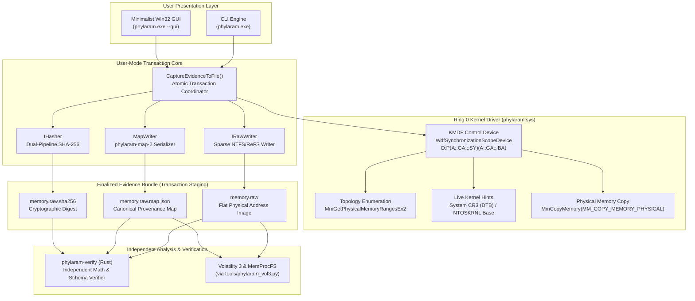

# PhylaRAM System Architecture

> **Normative Standard:** [`ENGINEERING_STANDARD.md`](../ENGINEERING_STANDARD.md)

PhylaRAM is structured into three strictly isolated tiers: a minimal Ring 0 kernel acquisition driver, a transaction-safe user-mode engine (serving CLI and GUI), and an independent hostile-input offline verifier.

---

## 1. Ring 0 KMDF Kernel Driver (`driver/`)

The kernel driver (`phylaram.sys`) operates with the smallest possible surface area:
- **Non-PnP Control Device:** Created via `WdfControlDeviceInitAllocate` with SDDL `D:P(A;;GA;;;SY)(A;;GA;;;BA)` restricting communication to `SYSTEM` and elevated Administrators.
- **Device-Level Synchronization:** Configured with `WdfSynchronizationScopeDevice` to serialize all IOCTLs with file cleanup and close events, eliminating race conditions during abrupt process termination.
- **Bounded Read Protocol:** User mode never submits arbitrary physical memory addresses to the driver. Reads reference a zero-based run index and run-relative offset verified against a frozen physical range snapshot taken at session start.
- **Physical Copying:** Calls `MmCopyMemory` with `MM_COPY_MEMORY_PHYSICAL` at `PASSIVE_LEVEL`. Transferred byte counts and observed `NTSTATUS` are faithfully returned to user space.

---

## 2. User-Mode Transaction Engine (`cli/`)

- **Single Evidence Transaction:** Both the CLI and GUI are presentation layers invoking `CaptureEvidenceToFile`.
- **Atomic Staging:** Evidence is written to temporary staging files (`<output>.partial`, `<output>.partial.map.json`, `<output>.partial.sha256`). The bundle is atomically promoted only when all bytes, hashes, and sidecars have flushed and balanced.
- **`UNREADABLE != ZERO` Accounting:** When a 16 MiB chunk encounters a hardware read error, the engine isolates the unreadable region down to 4 KiB pages and records the exact physical address and `NTSTATUS` in the provenance map.

---

## 3. Independent Offline Verifier (`tools/phylaram-verify/`)

Written in Rust without any shared code from the acquisition engine:
- Proves `RAW file logical size == highest physical range end`.
- Validates that physical ranges are non-overlapping, strictly ordered, and sum to `physical_bytes`.
- Proves that bytes in the RAW file at offsets recorded as unreadable are zero-backed representation bytes.
- Validates the flat SHA-256 digest over the entire logical RAW image.
